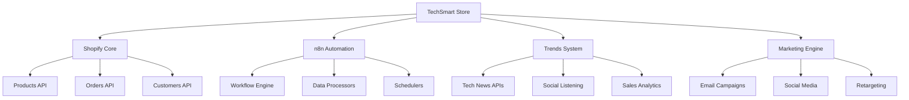

# Arquitectura TechSmart - E-commerce de Tecnología

## Resumen Ejecutivo

TechSmart será una tienda de e-commerce especializada en productos tecnológicos, construida sobre Shopify con enfoque en automatización y experiencia de usuario superior. Este documento analiza las opciones técnicas y recomienda la arquitectura óptima para el proyecto.

## Análisis de Tecnologías: Liquid vs Hydrogen

### Shopify Liquid (Tradicional)

#### Ventajas:
- **Rapidez de desarrollo**: Setup inmediato con temas pre-construidos
- **Costo menor**: Sin necesidad de hosting adicional
- **Ecosystem maduro**: +3.9M sitios activos, amplia comunidad
- **Mantenimiento simplificado**: Shopify maneja hosting, CDN y optimizaciones
- **Ideal para MVP**: Perfecto para lanzamiento rápido

#### Desventajas:
- **Limitaciones de personalización**: Restringido por arquitectura de temas
- **Performance limitada**: Dependiente de optimizaciones de Shopify
- **Flexibilidad reducida**: Difícil implementar funcionalidades complejas

### Shopify Hydrogen (Headless)

#### Ventajas:
- **Performance superior**: Edge computing, pre-rendering, velocidad de milisegundos
- **Personalización completa**: Control total sobre frontend con React
- **Escalabilidad**: Ideal para high-traffic y funcionalidades complejas
- **SEO optimizado**: Server-side rendering nativo
- **Integraciones avanzadas**: Fácil conexión con sistemas externos (n8n, APIs)

#### Desventajas:
- **Complejidad técnica**: Requiere desarrolladores React especializados
- **Costo adicional**: Hosting independiente (~$50-200/mes)
- **Tiempo de desarrollo**: Mayor inversión inicial
- **Mantenimiento**: Responsabilidad completa del desarrollo

## Arquitectura Recomendada para TechSmart

### Enfoque Directo: Shopify Hydrogen desde el inicio

#### Arquitectura Hydrogen con Lovable
```
┌─────────────────┐    ┌─────────────────┐    ┌─────────────────┐
│  Hydrogen App   │    │   Shopify API   │    │      n8n        │
│  - React Frontend│◄──►│   - GraphQL     │◄──►│   Workflows     │
│  - Custom UI    │    │   - Products    │    │   - Tendencias  │
│  - Advanced UX  │    │   - Orders      │    │   - Marketing   │
│  - PWA Support  │    │   - Customers   │    │   - Analytics   │
└─────────────────┘    └─────────────────┘    └─────────────────┘
         │                                            │
         ▼                                            ▼
┌─────────────────┐                        ┌─────────────────┐
│    Lovable      │                        │   External APIs │
│   Development   │                        │   - OpenAI      │
│   Platform      │                        │   - Trends Data │
│   - AI Coding   │                        │   - Social APIs │
└─────────────────┘                        └─────────────────┘
```

### Ventajas del Enfoque Hydrogen + Lovable

#### **AI-Powered Development Stack**
- **Lovable Platform**: Desarrollo acelerado con AI para React/Hydrogen
- **Claude Code**: Asistente de desarrollo, debugging y arquitectura
- **Rapid prototyping**: Iteración rápida de UI/UX
- **Modern tooling**: Stack tecnológico actualizado automáticamente

## Especificaciones Técnicas

### Stack Tecnológico

#### Frontend (Hydrogen + AI Development)
- **Framework**: Shopify Hydrogen (React 18+)
- **Development Platform**: Lovable AI-powered development
- **AI Assistant**: Claude Code para desarrollo y arquitectura
- **Styling**: Tailwind CSS + Hydrogen UI Components
- **Estado**: Hydrogen's built-in state management
- **Performance**: Edge-side rendering, Service Workers
- **PWA**: Progressive Web App capabilities

#### Backend & APIs
- **E-commerce**: Shopify Storefront API (GraphQL)
- **Automatización**: n8n Cloud/Self-hosted
- **Analytics**: Google Analytics 4 + Shopify Analytics
- **Trends Data**: Custom APIs + Web scraping workflows

#### Infraestructura
- **Development**: Lovable platform para desarrollo acelerado
- **Hosting**: Vercel/Netlify (Hydrogen deployment)
- **CDN**: Global edge network
- **Database**: Shopify native + External APIs
- **Monitoring**: Shopify Analytics + Custom dashboards

### Integraciones Clave



## Análisis de Costos - Hydrogen + Lovable

### Estructura de Herramientas
| Servicio | Descripción |
|----------|-------------|
| Lovable Platform | AI-powered development environment |
| Claude Code | AI assistant para desarrollo y arquitectura |
| Shopify Plus/Advanced | E-commerce backend con API GraphQL |
| Vercel Pro | Hosting optimizado para Hydrogen |
| n8n Cloud Pro | Automation workflows avanzados |
| External APIs | OpenAI, Google Trends, Social APIs |

*Costos específicos a definir según presupuesto disponible*

## Recomendación Final

### Para TechSmart: Hydrogen + Lovable desde el inicio

#### **Enfoque Directo con Hydrogen**
- **Performance superior** desde el lanzamiento
- **Flexibilidad completa** para funcionalidades avanzadas
- **Diferenciación competitiva** inmediata
- **Integración nativa** con sistemas de automatización (n8n)

#### **Ventajas del Stack AI**
- **Lovable**: Desarrollo acelerado con AI para frontend
- **Claude Code**: Asistente completo para arquitectura, debugging y optimización
- **Prototipado rápido** de UI/UX con feedback inteligente
- **Mantenimiento simplificado** con AI-powered code review
- **Stack moderno** y optimizado automáticamente

### Justificación:
- **Hydrogen + Lovable + Claude** permite desarrollo rápido sin sacrificar performance
- **Triple AI assistance** acelera significativamente el time-to-market
- **Arquitectura headless** facilita integraciones avanzadas (n8n, APIs)
- **Escalabilidad nativa** preparada para crecimiento
- **Claude Code** proporciona expertise continuo en arquitectura y best practices

### Próximos Pasos:
1. Setup Lovable environment para desarrollo Hydrogen
2. Integración Claude Code como asistente de arquitectura
3. Configuración Shopify API + GraphQL endpoints
4. Implementación workflows n8n básicos
5. Desarrollo iterativo con AI-powered feedback continuo

---

*Documento actualizado: Septiembre 2025*