# Modelo de Negocio TechSmart - Para Stakeholders & Inversores

## Resumen Ejecutivo

TechSmart es un e-commerce especializado en dropshipping de productos tecnológicos para el mercado estadounidense. Utilizamos inteligencia artificial y automatización avanzada para identificar productos trending antes que la competencia, ofreciendo una experiencia de compra superior con información detallada y curación experta.

---

## 📦 Modelo Dropshipping - Fundamentos

### ¿Cómo Funciona TechSmart?

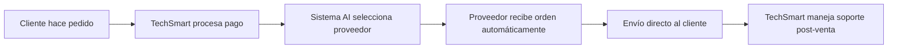

### Ventajas del Modelo
- ✅ **Cero inversión en inventario** - Reducción significativa de riesgos
- ✅ **Escalabilidad ilimitada** - Crecimiento sin limitaciones físicas
- ✅ **Flexibilidad total** - Catálogo dinámico según tendencias
- ✅ **Ubicación irrelevante** - Operación 100% digital
- ✅ **Márgenes optimizados** - Automatización reduce costos operativos

---

## 🎯 Estrategias de Detección de Tendencias

### Sistema de Inteligencia de Mercado

Nuestro sistema de IA analiza múltiples fuentes de datos para identificar productos trending antes que la competencia:

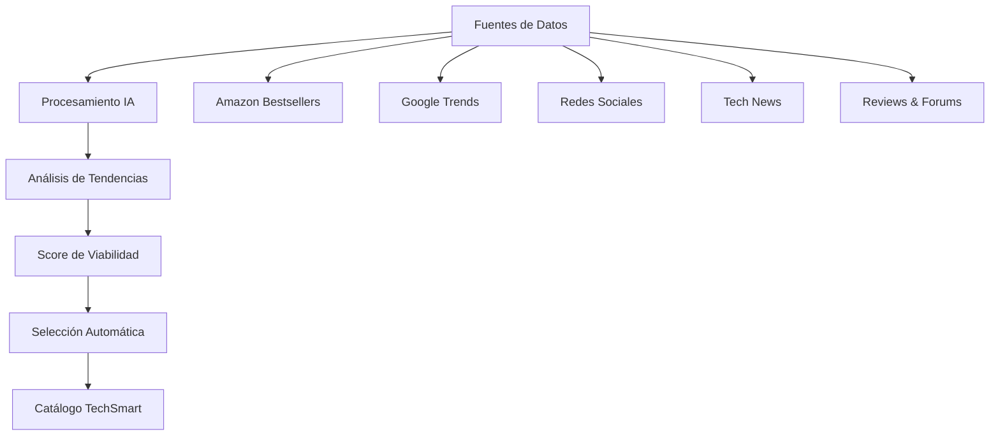

### Criterios de Selección Inteligente

#### **Algoritmo de Trending Score**
Cada producto recibe una puntuación basada en:

- **30%** - Menciones en redes sociales (Facebook, Instagram, Reddit)
- **25%** - Volumen de búsquedas (Google Trends)
- **20%** - Velocidad de ventas (Amazon, marketplaces)
- **15%** - Confiabilidad del proveedor (historial, ratings)
- **10%** - Potencial de margen (precio vs competencia)

#### **Filtros de Viabilidad**
- ✅ Proveedores confiables disponibles
- ✅ Envío factible a USA (2-7 días)
- ✅ Margen mínimo 20%
- ✅ Cumplimiento legal y regulatorio
- ✅ Nivel de competencia analizable

### Tecnologías Utilizadas

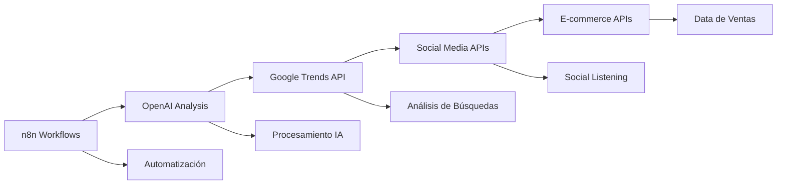

---

## 🏭 Red de Proveedores Estratégicos

### Estructura de Tres Niveles

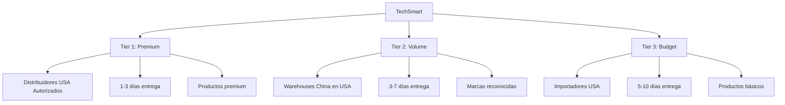

### Métricas de Rendimiento por Tier

| Métrica | Tier 1 Premium | Tier 2 Volume | Tier 3 Budget |
|---------|----------------|---------------|----------------|
| **Tiempo de procesamiento** | 24 horas | 48 horas | 72 horas |
| **Tiempo de envío** | 1-3 días | 3-7 días | 5-10 días |
| **Precisión de órdenes** | >99% | >97% | >95% |
| **Tasa de devoluciones** | <1% | <3% | <5% |
| **Tiempo de respuesta** | 2 horas | 8 horas | 24 horas |

---

## 📱 Experiencia del Cliente

### Journey del Cliente Optimizado

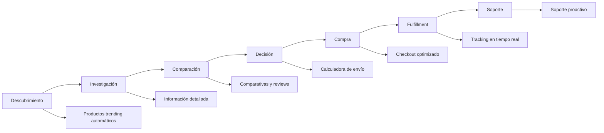

### Características Diferenciadoras

#### **Información Superior**
- Fichas técnicas completas y verificadas
- Comparativas automáticas entre productos similares
- Reviews curadas de fuentes confiables
- Visualización en contexto (hogar/oficina)

#### **Experiencia de Compra**
- Calculadora inteligente de envío
- Múltiples opciones de pago seguro
- Estimación precisa de entrega
- Notificaciones automáticas de estado

---

## 🎯 Selección de Productos y Categorías

### Distribución del Catálogo

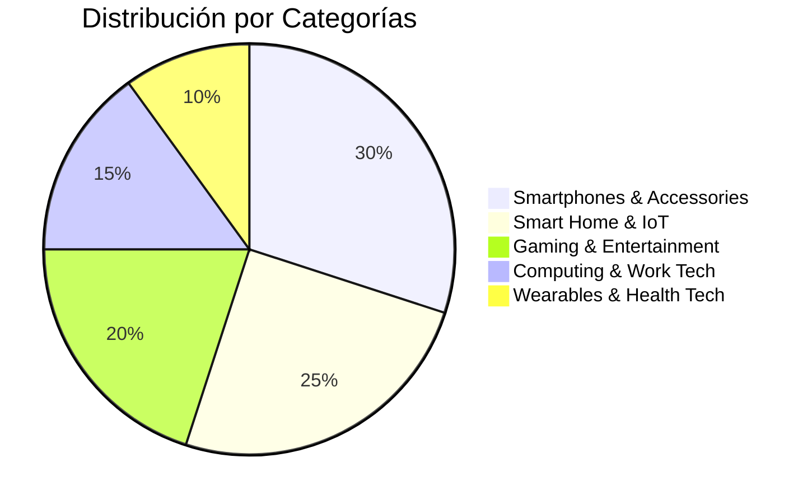

### Estrategias por Categoría

#### **📱 Smartphones & Accessories (30%)**
- **Enfoque**: Últimos lanzamientos y accesorios trending
- **Margen**: 15-25% (competitivo para adquisición)
- **Proveedores**: Tier 1 principalmente (distribuidores autorizados)

#### **🏠 Smart Home & IoT (25%)**
- **Enfoque**: Dispositivos para hogar inteligente post-pandemia
- **Margen**: 25-35% (alta demanda, menor competencia)
- **Oportunidad**: Mercado en expansión 15% anual

#### **🎮 Gaming & Entertainment (20%)**
- **Enfoque**: Controllers, headsets, streaming devices
- **Margen**: 20-30% (audiencia leal, dispuesta a pagar premium)
- **Target**: Millennials y Gen Z

#### **💻 Computing & Work Tech (15%)**
- **Enfoque**: Trabajo remoto y productividad
- **Margen**: 15-25% (volumen B2B potencial)
- **Oportunidad**: Mercado WFH $30B creciendo 18% anual

#### **⌚ Wearables & Health Tech (10%)**
- **Enfoque**: Smartwatches, fitness trackers
- **Margen**: 20-30% (nicho en crecimiento)
- **Tendencia**: Salud y wellness post-pandemia

---

## 💰 Estrategias de Pricing Dinámico

### Factores de Precio Inteligente

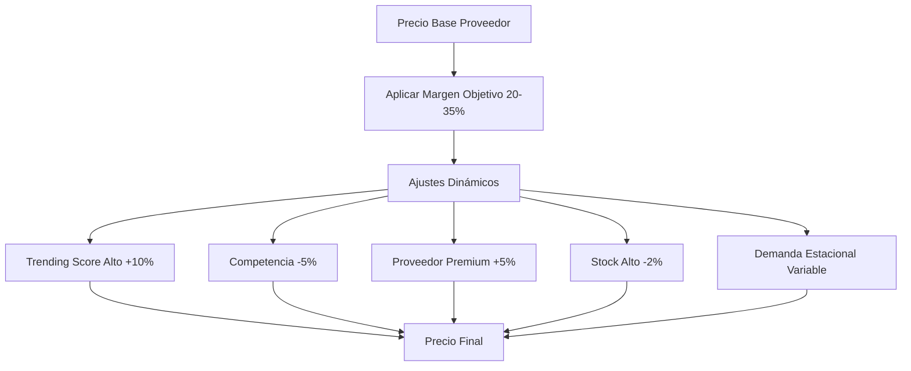

### Estrategias por Tipo de Producto

| Tipo de Producto | Estrategia | Margen | Diferenciación |
|------------------|------------|---------|----------------|
| **Premium** (iPhone, Samsung) | Pricing competitivo | 15-20% | Servicio superior |
| **Volume** (Xiaomi, accesorios) | Pricing por volumen | 25-30% | Best price guarantee |
| **Niche** (gadgets específicos) | Value pricing | 30-40% | Información exclusiva |
| **Promotional** (ofertas flash) | Penetration pricing | 15-25% | Customer acquisition |

---

## 📞 Atención al Cliente y Resolución de Disputas

### Estructura de Soporte Multi-Canal

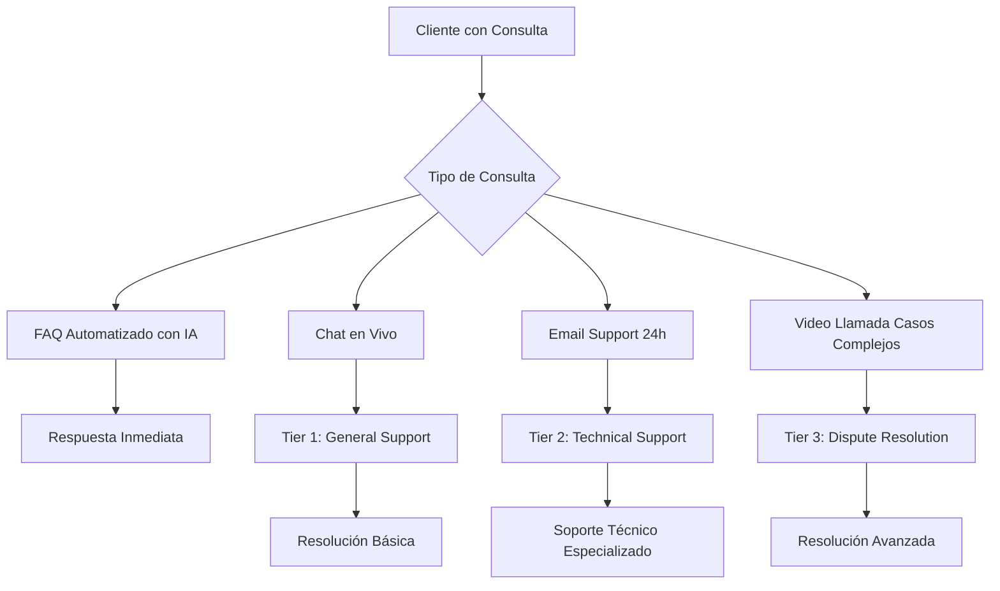

### Sistema de Resolución Automática

#### **Tipos de Disputas Principales**

1. **Producto No Llegó (30% casos)**
   - Investigación automática 24-48h
   - Verificación con proveedor y carrier
   - Resolución: Reenvío o refund completo

2. **Producto Defectuoso (25% casos)**
   - Timeline: 72h para resolución
   - Evidencia fotográfica/video
   - Resolución: Replacement o refund

3. **No Cumple Descripción (20% casos)**
   - Evaluación en 48h
   - Comparación specs vs descripción
   - Resolución: Partial refund o return

4. **Problemas de Envío (15% casos)**
   - Respuesta inmediata
   - Coordinación con carriers locales
   - Insurance claims cuando aplica

5. **Otros (10% casos)**
   - Evaluación caso por caso
   - Escalamiento según necesidad

### Políticas de Garantía Diferenciadas

- **Tier 1 Products**: 12 meses garantía completa
- **Tier 2 Products**: 6 meses garantía completa  
- **Tier 3 Products**: 3 meses garantía limitada
- **Satisfacción Garantizada**: 15 días return policy
- **Defectos de Fábrica**: 30 días replacement inmediato

---

## 🚚 Gestión de Envíos USA

### Zonas de Envío Optimizadas

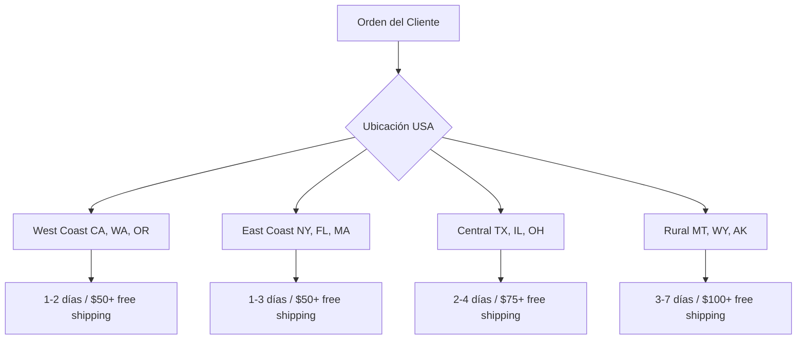

### Integración con Shopify

#### **Flujo Traditional vs TechSmart**

**Shopify Tradicional:**
```
Cliente → Store → Warehouse → Pick & Pack → Carrier → Cliente
```

**TechSmart Dropshipping:**
```
Cliente → TechSmart → IA Selecciona Proveedor → Envío Directo → Cliente
         ↓
    Notificación Automática + Tracking
```

### Gestión de Inventario Sin Inventario

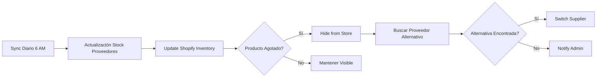

---

## 📈 Estrategias de Marketing Digital

### Embudo de Conversión Automatizado

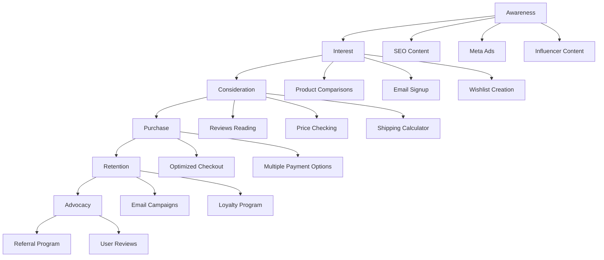

### Estrategia de Contenido SEO-First

#### **Pilares de Contenido**

1. **Product Comparison Pages**
   - "iPhone 15 vs Samsung S24 - USA Review"
   - "Best Gaming Headsets 2025 USA Guide"
   - "Top Smartwatches for Americans 2025"

2. **Technical Reviews**
   - Análisis profundos con specs USA
   - Video reviews con precios locales
   - Experiencias reales de usuarios USA

3. **Trending Tech News**
   - "CES 2025 USA Highlights"
   - "Latest Apple USA Announcements"
   - "Android Updates for US Market"

### Marketing Mix Digital 100% Meta/Facebook

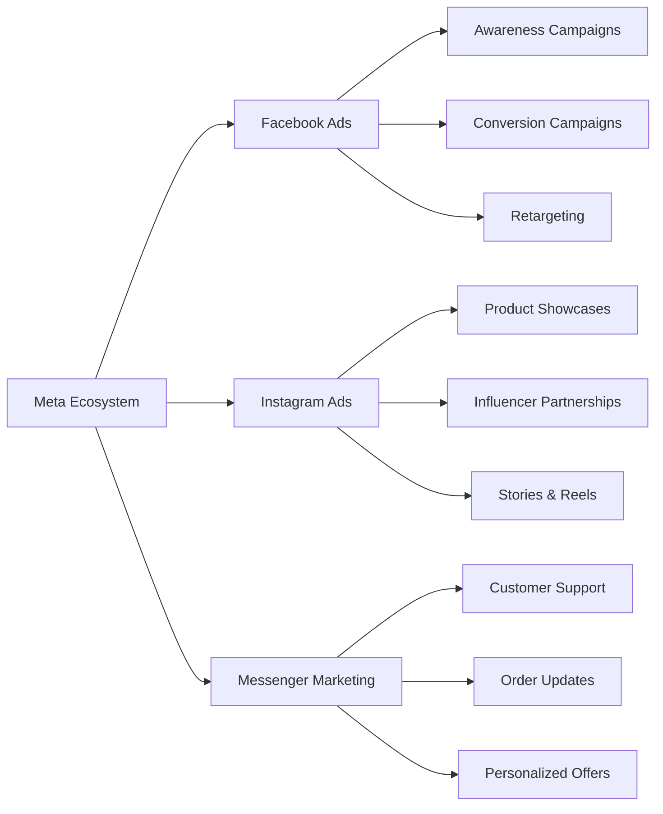

### Segmentación de Email Marketing

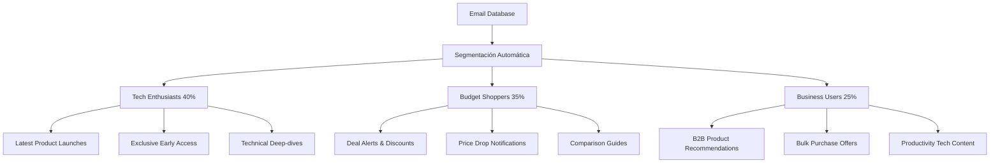

---

## 🔄 Operaciones Diarias Automatizadas

### Rutina Matutina Automatizada

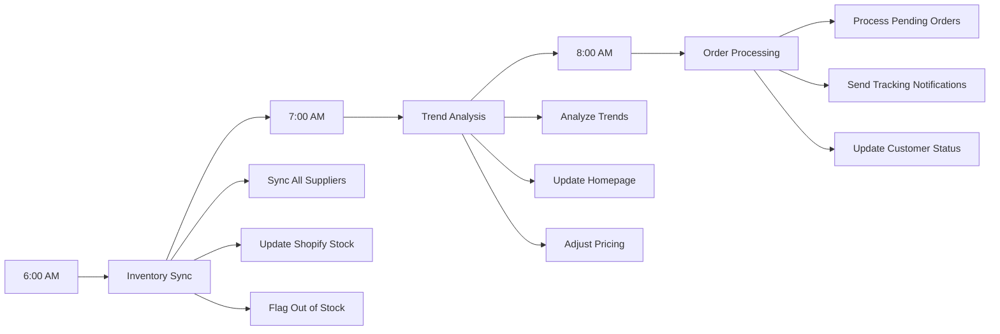

### Customer Service Automation

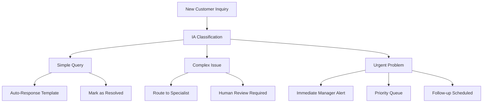

---

## 📊 Métricas y KPIs de Seguimiento

### Dashboard de Performance en Tiempo Real

#### **Métricas de Ventas**
- Revenue diario/mensual
- Conversion rate por fuente de tráfico
- Average Order Value por categoría
- Customer acquisition cost por canal

#### **Métricas Operativas**
- Tiempo de procesamiento de órdenes
- Tiempo de respuesta de proveedores
- Customer satisfaction score (CSAT)
- Tasa de resolución en primer contacto

#### **Métricas de Inventario**
- Productos agotados por día
- Rotación de inventario virtual
- Performance de proveedores
- Accuracy de predicciones de stock

### Reporting Automatizado

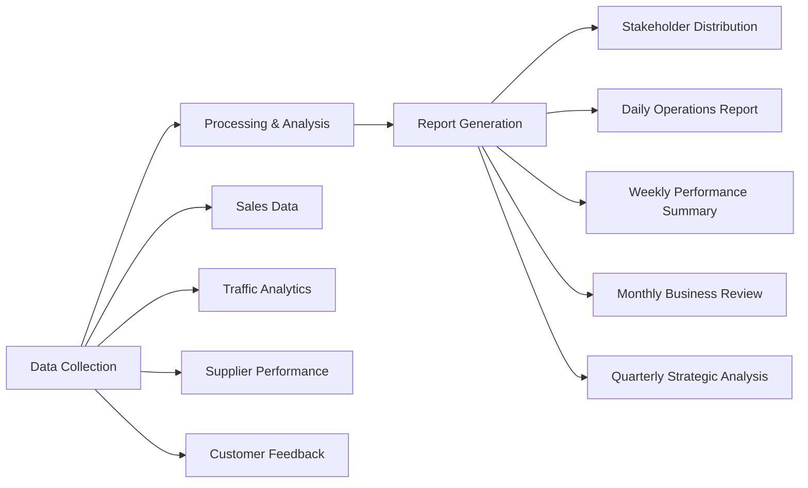

---

## 💡 Roadmap de Implementación

### Fases de Desarrollo

#### **Fase 1: Setup Básico (Meses 1-2)**
- Configuración Shopify + Hydrogen
- Integración con 3-5 proveedores Tier 1
- Sistema básico de procesamiento de órdenes
- Customer support fundamental (chat + email)

#### **Fase 2: Automatización (Meses 3-4)**
- Workflows completos de n8n para análisis de tendencias
- Expansión a 15-20 proveedores across tiers
- Motor de pricing dinámico
- Automatización de customer service con IA

#### **Fase 3: Scaling (Meses 5-6)**
- Automatización completa de marketing
- Advanced analytics y business intelligence
- Optimización móvil y PWA
- Preparación para expansión internacional

#### **Fase 4: Optimization (Meses 7+)**
- Machine learning para predicción de inventario y pricing
- Programa de lealtad para retención
- Portal B2B para clientes empresariales
- Marketplace de APIs para integraciones third-party

---

## 🎯 Ventajas Competitivas Clave

### Diferenciadores Únicos

1. **Detección de Tendencias con IA**
   - Identificación 2-7 días antes que competencia
   - Análisis predictivo de demanda
   - Curación automática de productos

2. **Experiencia de Cliente Superior**
   - Información 10x más detallada que promedio
   - Visualización contextual de productos
   - Soporte proactivo y resolución rápida

3. **Operaciones Automatizadas**
   - 90% de procesos automatizados
   - Escalabilidad sin incremento proporcional de costos
   - Respuesta en tiempo real a cambios de mercado

4. **Marketing Intelligence**
   - Segmentación automática basada en comportamiento
   - Personalización en tiempo real
   - ROI optimizado mediante IA

---

*Documento para Stakeholders & Inversores - Versión 1.0 | Septiembre 2025*
*Para información técnica detallada, consultar documentación de desarrollo*