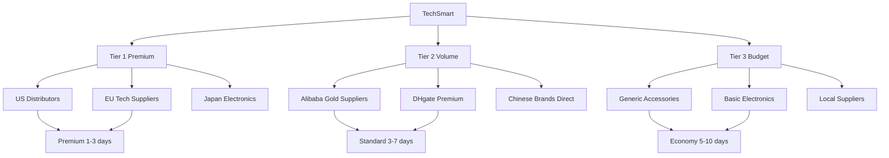
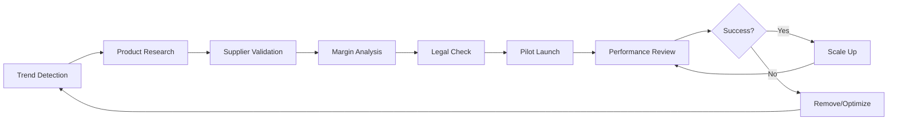
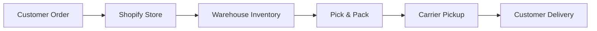
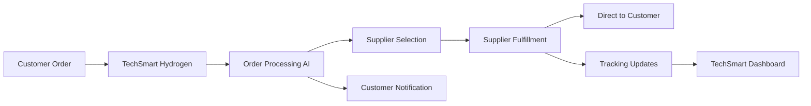
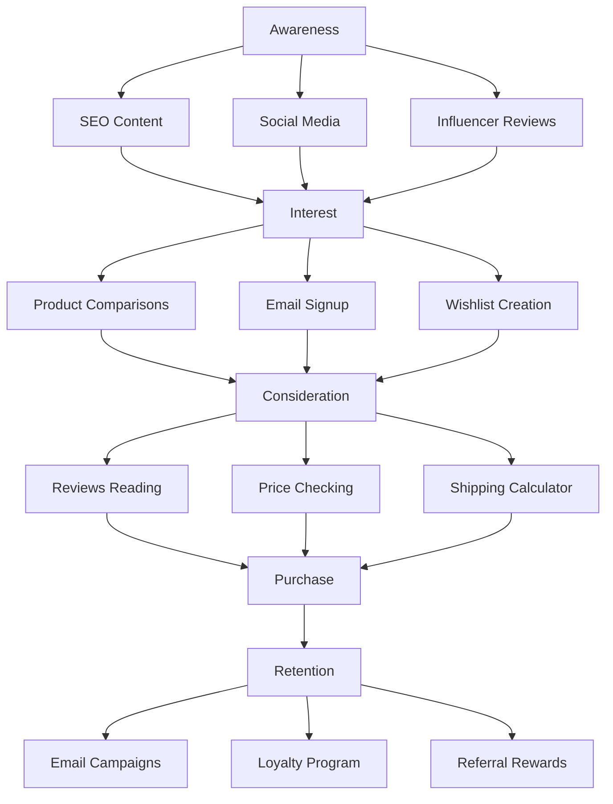

# Modelo de Negocio TechSmart - E-commerce Dropshipping de Tecnología

## Resumen Ejecutivo

TechSmart es un e-commerce especializado en dropshipping de productos tecnológicos para el mercado estadounidense, con un enfoque en automatización avanzada, selección inteligente de productos trending y experiencia de cliente superior. El modelo elimina la necesidad de inventario físico mientras maximiza márgenes y minimiza riesgos operativos.

---

## 📦 Modelo Dropshipping - Fundamentos

### ¿Qué es Dropshipping?

El dropshipping es un modelo de negocio donde **TechSmart no mantiene inventario físico**. Cuando un cliente realiza una compra:

1. **Cliente** hace pedido en TechSmart.com
2. **TechSmart** procesa el pago y recibe el margen
3. **Proveedor** recibe orden automáticamente
4. **Proveedor** envía producto directamente al cliente
5. **TechSmart** maneja atención al cliente y garantías

### Ventajas del Modelo
- ✅ **Cero inversión en inventario**
- ✅ **Escalabilidad ilimitada**
- ✅ **Riesgo financiero mínimo**
- ✅ **Flexibilidad en catálogo**
- ✅ **Ubicación geográfica irrelevante**

### Desafíos y Soluciones
- ❌ **Control limitado de fulfillment** → Proveedores verificados y SLAs
- ❌ **Márgenes menores** → Volumen y automatización
- ❌ **Competencia alta** → Diferenciación por AI y experiencia

---

## 🏭 Gestión de Proveedores y Logística

### Criterios de Selección de Proveedores

#### **Proveedores Tier 1 (Premium)**
- **Ubicación**: Estados Unidos (warehouses locales)
- **Tiempo de envío**: 1-3 días dentro de USA
- **Calidad**: Productos originales con garantía
- **Precios**: Competitivos pero no los más baratos
- **Ejemplos**: Distribuidores autorizados Apple, Samsung, Sony en USA

#### **Proveedores Tier 2 (Volume)**  
- **Ubicación**: China con warehouses en USA (California, New Jersey)
- **Tiempo de envío**: 3-7 días
- **Calidad**: Buenos productos, marcas reconocidas
- **Precios**: Muy competitivos
- **Ejemplos**: Anker, Xiaomi, OnePlus con fulfillment centers USA

#### **Proveedores Tier 3 (Budget)**
- **Ubicación**: Importadores USA con stock chino
- **Tiempo de envío**: 5-10 días  
- **Calidad**: Aceptable para productos básicos
- **Precios**: Los más económicos
- **Ejemplos**: Accesorios genéricos con warehouses USA

### Red de Proveedores Estratégicos



### Sistema de Gestión Logística

#### **Automatización de Órdenes**
```javascript
// Ejemplo de workflow automatizado
const orderWorkflow = {
  orderReceived: async (order) => {
    // 1. Validar pago y customer
    await validatePayment(order);
    
    // 2. Seleccionar mejor proveedor
    const supplier = await selectOptimalSupplier(order.products);
    
    // 3. Enviar orden a proveedor
    await forwardOrderToSupplier(supplier, order);
    
    // 4. Notificar al cliente
    await notifyCustomer(order, supplier.shippingTime);
    
    // 5. Iniciar tracking
    await initOrderTracking(order);
  }
};
```

#### **SLAs con Proveedores**
| Métrica | Tier 1 | Tier 2 | Tier 3 |
|---------|--------|--------|--------|
| **Processing Time** | 24h | 48h | 72h |
| **Shipping Time** | 1-3 días | 3-7 días | 5-10 días |
| **Order Accuracy** | >99% | >97% | >95% |
| **Return Rate** | <1% | <3% | <5% |
| **Response Time** | 2h | 8h | 24h |

---

## 📱 Arquitectura de Plataforma Hydrogen

### Secciones Clave de la Plataforma

#### **Frontend Customer-Facing**

##### 1. **Homepage - Productos Trending**
```jsx
// Componente principal de productos trending
const TrendingProducts = () => {
  const trendingData = useTrendingProducts();
  return (
    <section className="trending-section">
      <h2>🔥 Trending Now</h2>
      <ProductGrid products={trendingData} />
      <TrendScore products={trendingData} />
    </section>
  );
};
```

##### 2. **Product Detail Page (PDP)**
```jsx
const ProductDetail = ({ product }) => {
  return (
    <div className="product-detail">
      <ProductGallery images={product.images} />
      <ProductInfo 
        specs={product.specifications}
        reviews={product.reviews}
        trending={product.trendingScore}
      />
      <ShippingCalculator 
        suppliers={product.suppliers}
        customerLocation={user.location}
      />
      <PurchaseOptions 
        variants={product.variants}
        pricing={product.dynamicPricing}
      />
    </div>
  );
};
```

##### 3. **Smart Checkout**
```jsx
const SmartCheckout = () => {
  return (
    <CheckoutFlow>
      <ShippingOptions />
      <PaymentMethods />
      <OrderSummary />
      <SupplierSelection />
      <DeliveryEstimate />
    </CheckoutFlow>
  );
};
```

#### **Backend Admin Dashboard**

##### 1. **Supplier Management**
- Panel de proveedores con métricas en tiempo real
- SLA monitoring y alertas
- Automated supplier scoring
- Order forwarding automation

##### 2. **Inventory Sync**
- Real-time stock levels desde suppliers
- Automated product imports
- Price synchronization
- Product status updates

##### 3. **Order Fulfillment**
- Automated order routing
- Multi-supplier order splitting
- Tracking integration
- Customer communications

### Gestión de Envíos en Hydrogen

#### **Shipping Calculator Component**
```jsx
const ShippingCalculator = ({ product, customerLocation }) => {
  const [shippingOptions, setShippingOptions] = useState([]);
  
  useEffect(() => {
    const calculateShipping = async () => {
      const suppliers = await getProductSuppliers(product.id);
      const options = suppliers.map(supplier => ({
        supplier: supplier.name,
        cost: calculateShippingCost(supplier, customerLocation),
        time: estimateDeliveryTime(supplier, customerLocation),
        tier: supplier.tier
      }));
      setShippingOptions(options);
    };
    
    calculateShipping();
  }, [product, customerLocation]);

  return (
    <div className="shipping-calculator">
      <h3>Opciones de Envío</h3>
      {shippingOptions.map(option => (
        <ShippingOption key={option.supplier} {...option} />
      ))}
    </div>
  );
};
```

#### **Order Tracking System**
```jsx
const OrderTracking = ({ orderId }) => {
  const orderStatus = useOrderTracking(orderId);
  
  return (
    <div className="order-tracking">
      <TrackingTimeline status={orderStatus} />
      <SupplierInfo supplier={orderStatus.supplier} />
      <DeliveryEstimate estimated={orderStatus.estimatedDelivery} />
      <CustomerSupport orderId={orderId} />
    </div>
  );
};
```

---

## 🎯 Selección de Productos y Estrategia

### Sistema Automatizado de Selección

#### **Criterios de Selección AI**
```javascript
const productSelectionAI = {
  trendingScore: (product) => {
    return (
      socialMentions(product) * 0.3 +
      searchVolume(product) * 0.25 +
      salesVelocity(product) * 0.2 +
      supplierReliability(product) * 0.15 +
      marginPotential(product) * 0.1
    );
  },
  
  viabilityCheck: (product) => {
    return {
      supplierAvailable: hasReliableSuppliers(product),
      shippingFeasible: canShipToTarget(product),
      marginSufficient: calculateMargin(product) > 20,
      legalCompliance: checkRegulations(product),
      competitionLevel: analyzeCompetition(product)
    };
  }
};
```

#### **Categorías Objetivo**

##### **Smartphones y Accesorios (30% del catálogo)**
- **Productos**: iPhone, Samsung, Xiaomi, OnePlus
- **Accesorios**: Cases, chargers, wireless accessories
- **Margen objetivo**: 15-25%
- **Suppliers**: Distribuidores autorizados + importadores

##### **Gadgets para Hogar Inteligente (25%)**
- **Productos**: Smart speakers, IoT devices, security cameras
- **Margen objetivo**: 25-35%
- **Tendencia**: Alta demanda post-pandemia

##### **Gaming y Entretenimiento (20%)**
- **Productos**: Controllers, headsets, streaming devices
- **Margen objetivo**: 20-30%
- **Audience**: Millennials y Gen Z

##### **Oficina y Trabajo Remoto (15%)**
- **Productos**: Laptops, monitors, ergonomic accessories
- **Margen objetivo**: 15-25%
- **B2B potential**: Empresas pequeñas

##### **Wearables y Fitness Tech (10%)**
- **Productos**: Smartwatches, fitness trackers
- **Margen objetivo**: 20-30%
- **Growth**: Mercado en expansión

### Pipeline de Productos



---

## 💰 Estrategias de Pricing

### Modelo de Precios Dinámico

#### **Factores de Pricing**
```javascript
const dynamicPricing = {
  basePrice: supplierCost,
  margin: targetMargin, // 20-35%
  adjustments: {
    demandMultiplier: trendingScore > 80 ? 1.1 : 1.0,
    competitionFactor: competitorPrices.average * 0.95,
    supplierTier: supplierTier === 1 ? 1.05 : 1.0,
    seasonality: seasonalDemand,
    inventory: supplierStock > 100 ? 0.98 : 1.02
  }
};
```

### Estrategias por Categoría

#### **Premium Products (iPhone, Samsung flagship)**
- **Estrategia**: Competitive pricing
- **Margen**: 15-20%
- **Diferenciación**: Servicio superior, garantía extendida
- **Proveedores**: Tier 1 únicamente

#### **Volume Products (Xiaomi, accesorios populares)**
- **Estrategia**: Volume-based pricing
- **Margen**: 25-30%
- **Diferenciación**: Best price guarantee
- **Proveedores**: Mix Tier 1/2

#### **Niche Products (gadgets específicos)**
- **Estrategia**: Value pricing
- **Margen**: 30-40%
- **Diferenciación**: Exclusividad, información detallada
- **Proveedores**: Tier 2/3

#### **Promotional Products (ofertas flash)**
- **Estrategia**: Penetration pricing
- **Margen**: 15-25%
- **Objetivo**: Customer acquisition
- **Duración**: Limitada

---

## 📞 Atención al Cliente y Resolución de Disputas

### Estructura de Customer Support

#### **Canales de Atención**
1. **Chat en vivo** (horario comercial)
2. **Email support** (24h response time)
3. **WhatsApp Business** (mercado LATAM)
4. **FAQ automatizado** con AI
5. **Video llamadas** (casos complejos)

#### **Team Structure**
```
Support Manager
├── Tier 1: General Support (2 agentes)
│   ├── Order inquiries
│   ├── Shipping questions
│   └── Product information
├── Tier 2: Technical Support (1 especialista)
│   ├── Product troubleshooting
│   ├── Technical specifications
│   └── Compatibility issues
└── Tier 3: Dispute Resolution (1 manager)
    ├── Returns & refunds
    ├── Supplier issues
    └── Legal matters
```

### Sistema de Tickets Automatizado

#### **Categorización Automática**
```javascript
const ticketClassification = {
  categories: {
    'shipping-inquiry': ['dónde está', 'tracking', 'envío'],
    'product-question': ['compatible', 'funciona', 'especificaciones'],
    'order-issue': ['cancelar', 'cambiar', 'problema con orden'],
    'return-request': ['devolver', 'no funciona', 'defectuoso'],
    'billing-question': ['pago', 'cargo', 'factura']
  },
  
  priorityLevel: (ticket) => {
    const urgentKeywords = ['defectuoso', 'no llegó', 'estafa', 'urgente'];
    return urgentKeywords.some(keyword => 
      ticket.message.toLowerCase().includes(keyword)
    ) ? 'high' : 'normal';
  }
};
```

### Resolución de Disputas

#### **Tipos de Disputas Comunes**

##### **1. Producto No Llegó**
- **Timeline**: Investigación en 24-48h
- **Proceso**: 
  1. Verificar tracking con supplier
  2. Contactar courier si es necesario
  3. Ofrecer reenvío o refund completo
  4. Documentar para supplier SLA

##### **2. Producto Defectuoso**
- **Timeline**: Resolución en 72h
- **Proceso**:
  1. Solicitar evidencia (fotos/video)
  2. Validar con supplier
  3. Ofrecer replacement o refund
  4. Arranged return si es necesario

##### **3. Producto No Como Se Describió**
- **Timeline**: Evaluación en 48h
- **Proceso**:
  1. Revisar descripción del producto
  2. Comparar con supplier specs
  3. Ofrecer partial refund o return
  4. Update product description si es necesario

##### **4. Problemas de Shipping**
- **Timeline**: Respuesta inmediata
- **Proceso**:
  1. Verificar carrier tracking
  2. Contactar local postal service
  3. File insurance claim si aplica
  4. Reenvío o refund según caso

#### **Automated Dispute Resolution**
```javascript
const disputeResolution = {
  autoResolve: (dispute) => {
    if (dispute.type === 'shipping-delay' && dispute.daysLate < 5) {
      return {
        action: 'offer_discount',
        amount: '10%',
        nextOrder: true
      };
    }
    
    if (dispute.type === 'minor-defect' && dispute.orderValue < 50) {
      return {
        action: 'partial_refund',
        amount: '25%',
        keepProduct: true
      };
    }
    
    return { action: 'escalate_to_human' };
  }
};
```

### Políticas de Garantía

#### **Garantía TechSmart**
- **Productos Tier 1**: 12 meses garantía completa
- **Productos Tier 2**: 6 meses garantía completa
- **Productos Tier 3**: 3 meses garantía limitada
- **Defectos de fábrica**: 30 días replacement
- **Satisfacción garantizada**: 15 días return policy

---

## 🚚 Gestión de Envíos y Fulfillment

### Cómo Funciona Shopify Shipping vs TechSmart

#### **Shopify Traditional Shipping**


#### **TechSmart Dropshipping Flow**


### Integración con Shopify Fulfillment

#### **Configuración en Hydrogen**
```jsx
const FulfillmentManager = () => {
  const processOrder = async (order) => {
    // 1. Validate order and payment
    const validatedOrder = await validateOrder(order);
    
    // 2. Select optimal supplier
    const supplier = await selectSupplier(order.items, order.destination);
    
    // 3. Create fulfillment in Shopify
    const fulfillment = await shopify.fulfillment.create({
      orderId: order.id,
      trackingNumber: supplier.trackingNumber,
      trackingUrl: supplier.trackingUrl,
      carrier: supplier.carrier,
      notifyCustomer: true
    });
    
    // 4. Forward order to supplier
    await supplier.api.createOrder({
      items: order.items,
      shipping: order.shippingAddress,
      instructions: order.specialInstructions
    });
    
    return fulfillment;
  };
  
  return <FulfillmentDashboard onProcessOrder={processOrder} />;
};
```

### Gestión de Inventario Sin Inventario

#### **Real-time Stock Sync**
```javascript
const inventorySync = {
  suppliers: ['supplier1', 'supplier2', 'supplier3'],
  
  syncInventory: async () => {
    for (const supplier of suppliers) {
      const stockData = await supplier.api.getInventory();
      await updateShopifyInventory(stockData);
    }
  },
  
  handleOutOfStock: async (productId) => {
    // 1. Hide from store immediately
    await shopify.product.update(productId, { published: false });
    
    // 2. Check alternative suppliers
    const alternatives = await findAlternativeSuppliers(productId);
    
    // 3. Update if found, or notify admin
    if (alternatives.length > 0) {
      await switchSupplier(productId, alternatives[0]);
    } else {
      await notifyAdmin(`Product ${productId} out of stock`);
    }
  }
};
```

### Shipping Zones y Pricing

#### **Configuración de Zonas USA**
```javascript
const shippingZones = {
  'zone-1-west-coast': {
    states: ['CA', 'WA', 'OR', 'NV', 'AZ'],
    suppliers: ['tier1-california', 'tier2-west'],
    estimatedDays: '1-2',
    freeShippingThreshold: 50
  },
  
  'zone-2-east-coast': {
    states: ['NY', 'NJ', 'MA', 'FL', 'VA'],
    suppliers: ['tier1-newjersey', 'tier2-east'],
    estimatedDays: '1-3',
    freeShippingThreshold: 50
  },
  
  'zone-3-central': {
    states: ['TX', 'IL', 'OH', 'MI', 'CO'],
    suppliers: ['tier1-dallas', 'tier2-central'],
    estimatedDays: '2-4',
    freeShippingThreshold: 75
  },
  
  'zone-4-rural': {
    states: ['MT', 'WY', 'ND', 'SD', 'AK', 'HI'],
    suppliers: ['tier2-distributed', 'tier3-national'],
    estimatedDays: '3-7',
    freeShippingThreshold: 100
  }
};
```

#### **Dynamic Shipping Calculator**
```jsx
const ShippingRateCalculator = ({ order, destination }) => {
  const [rates, setRates] = useState([]);
  
  useEffect(() => {
    const calculateRates = async () => {
      const zone = getShippingZone(destination);
      const suppliers = getAvailableSuppliers(order.items, zone);
      
      const calculatedRates = suppliers.map(supplier => ({
        supplier: supplier.name,
        cost: calculateShippingCost(supplier, destination, order.weight),
        time: estimateDeliveryTime(supplier, destination),
        reliability: supplier.reliabilityScore
      }));
      
      setRates(calculatedRates);
    };
    
    calculateRates();
  }, [order, destination]);

  return (
    <div className="shipping-rates">
      {rates.map(rate => (
        <ShippingRateOption key={rate.supplier} {...rate} />
      ))}
    </div>
  );
};
```

---

## 📈 Marketing Strategies para E-commerce Tech

### Marketing Mix Específico para USA Tech Market

#### **1. SEO-First Approach**
```
Content Strategy:
├── Product Comparison Pages
│   ├── "iPhone 15 vs Samsung Galaxy S24 - USA Review"
│   ├── "Best Gaming Headsets 2025 USA Buyers Guide"
│   └── "Top Smartwatches for Americans 2025"
├── Technical Reviews
│   ├── In-depth product analysis with US specs
│   ├── Video reviews & unboxings with US pricing
│   └── Real user experience from US customers
└── Trending Tech News
    ├── "CES 2025 USA Highlights"
    ├── "Latest Apple USA Announcements"
    └── "Android Updates for US Market"
```

#### **2. USA Influencer Partnerships**
- **Tech YouTubers**: MKBHD, Unbox Therapy, Austin Evans style channels
- **Gaming streamers**: Twitch/YouTube gaming influencers
- **Lifestyle tech**: Casey Neistat, Peter McKinnon followers
- **TikTok tech**: Short-form tech content creators

#### **3. Paid Advertising Strategy**
```javascript
const adStrategy = {
  googleAds: {
    campaigns: ['search', 'shopping', 'display'],
    keywords: ['comprar iPhone', 'tecnología barata', 'gadgets 2025'],
    budget: '40% del ad spend',
    targeting: 'search intent + lookalikes'
  },
  
  facebookMeta: {
    campaigns: ['awareness', 'conversion', 'retargeting'],
    creative: 'video product demos + user reviews',
    budget: '35% del ad spend',
    targeting: 'tech interests + behaviors'
  },
  
  tiktokAds: {
    campaigns: ['brand awareness', 'traffic'],
    creative: 'trending tech videos + challenges',
    budget: '15% del ad spend',
    targeting: 'Gen Z + millennials'
  },
  
  youtubeAds: {
    campaigns: ['awareness', 'consideration'],
    creative: 'product reviews + tutorials',
    budget: '10% del ad spend',
    targeting: 'tech channels viewers'
  }
};
```

#### **4. Email Marketing Segmentado**
```
Segments:
├── Tech Enthusiasts
│   ├── Latest product launches
│   ├── Exclusive early access
│   └── Technical deep-dives
├── Budget Shoppers
│   ├── Deal alerts & discounts
│   ├── Price drop notifications
│   └── Comparison guides
├── Business Users
│   ├── B2B product recommendations
│   ├── Bulk purchase offers
│   └── Productivity tech content
└── Mobile-First Users
    ├── Smartphone accessories
    ├── Mobile app exclusive deals
    └── Quick purchase flows
```

### Customer Acquisition Funnel



---

## 🔄 Operaciones y Automatización

### Daily Operations Workflow

#### **Morning Routine (Automated)**
```javascript
const morningOperations = {
  // 6:00 AM - Inventory Sync
  inventoryUpdate: async () => {
    await syncAllSupplierInventories();
    await updateShopifyStock();
    await flagOutOfStockItems();
  },
  
  // 7:00 AM - Trend Analysis
  trendAnalysis: async () => {
    const trendingProducts = await analyzeTrends();
    await updateHomepageFeatured(trendingProducts);
    await adjustPricing(trendingProducts);
  },
  
  // 8:00 AM - Order Processing
  orderProcessing: async () => {
    const pendingOrders = await getPendingOrders();
    await processOrdersAutomatically(pendingOrders);
    await sendTrackingNotifications();
  }
};
```

#### **Customer Service Operations**
```javascript
const customerServiceOps = {
  ticketTriage: async () => {
    const newTickets = await getNewTickets();
    await categorizeTicketsAI(newTickets);
    await assignToPriority(newTickets);
  },
  
  automatedResponses: async () => {
    const simpleQueries = await getSimpleQueries();
    await respondWithTemplates(simpleQueries);
    await updateTicketStatus(simpleQueries, 'resolved');
  },
  
  escalationManagement: async () => {
    const urgentTickets = await getUrgentTickets();
    await notifyManagers(urgentTickets);
    await scheduleFollowUp(urgentTickets);
  }
};
```

### Performance Metrics Dashboard

#### **Real-time KPIs**
```jsx
const PerformanceDashboard = () => {
  const [metrics, setMetrics] = useState({});
  
  useEffect(() => {
    const updateMetrics = async () => {
      const data = {
        // Sales Metrics
        dailyRevenue: await getDailyRevenue(),
        conversionRate: await getConversionRate(),
        averageOrderValue: await getAOV(),
        
        // Operations Metrics  
        orderProcessingTime: await getOrderProcessingTime(),
        supplierResponseTime: await getSupplierResponseTime(),
        customerSatisfaction: await getCSAT(),
        
        // Inventory Metrics
        outOfStockItems: await getOutOfStockCount(),
        inventoryTurnover: await getInventoryTurnover(),
        supplierPerformance: await getSupplierPerformance()
      };
      
      setMetrics(data);
    };
    
    updateMetrics();
    const interval = setInterval(updateMetrics, 300000); // 5 min
    
    return () => clearInterval(interval);
  }, []);

  return (
    <DashboardGrid>
      <MetricCard title="Daily Revenue" value={metrics.dailyRevenue} />
      <MetricCard title="Conversion Rate" value={metrics.conversionRate} />
      <MetricCard title="AOV" value={metrics.averageOrderValue} />
      {/* ... more metrics */}
    </DashboardGrid>
  );
};
```

---

## 💡 Próximos Pasos y Implementación

### Fase 1: Setup Básico (Mes 1-2)
- [ ] **Configurar Shopify + Hydrogen**: Store setup y desarrollo inicial
- [ ] **Integrar 3-5 proveedores Tier 1**: Validar modelo con productos premium
- [ ] **Sistema básico de orders**: Automatización simple de fulfillment
- [ ] **Customer support básico**: Chat en vivo y email

### Fase 2: Automatización (Mes 3-4)
- [ ] **n8n workflows completos**: Trend analysis + order processing
- [ ] **Expandir red de proveedores**: 15-20 suppliers across tiers
- [ ] **Dynamic pricing**: Implementar pricing engine
- [ ] **Customer service automation**: AI chatbot + ticket system

### Fase 3: Scaling (Mes 5-6)
- [ ] **Marketing automation**: Full funnel implementation
- [ ] **Advanced analytics**: Business intelligence dashboard
- [ ] **Mobile optimization**: PWA + mobile-first experience
- [ ] **International expansion**: Additional LATAM markets

### Fase 4: Optimization (Mes 7+)
- [ ] **Machine learning**: Predictive analytics para inventory y pricing
- [ ] **Loyalty program**: Customer retention initiatives
- [ ] **B2B features**: Business customer portal
- [ ] **API marketplace**: Third-party integrations

---

*Documento de modelo de negocio - Versión 1.0 | Septiembre 2025*
*Para soporte técnico y consultas: [Contactar equipo](mailto:jlpq@thedigitallab.dev)*