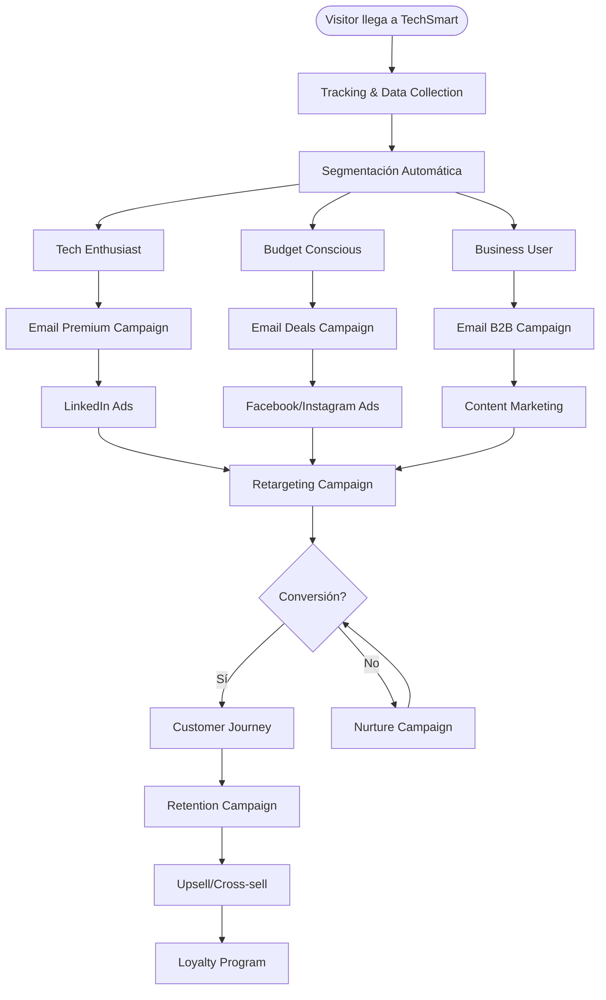
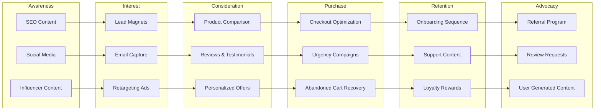
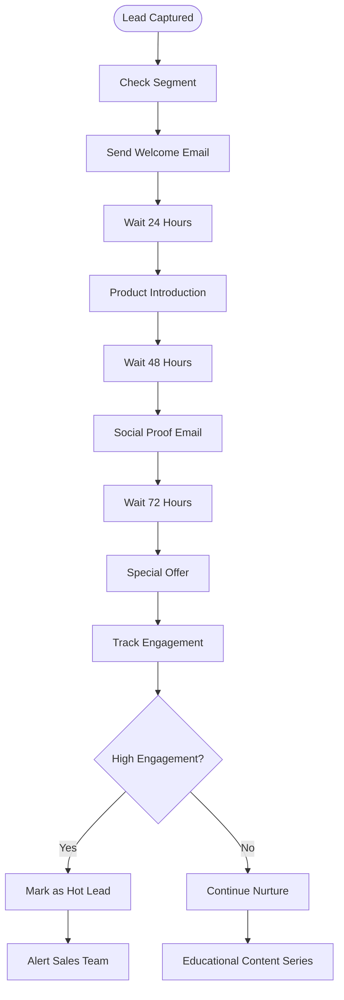
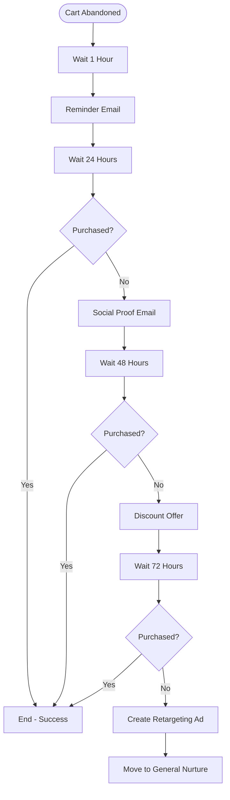
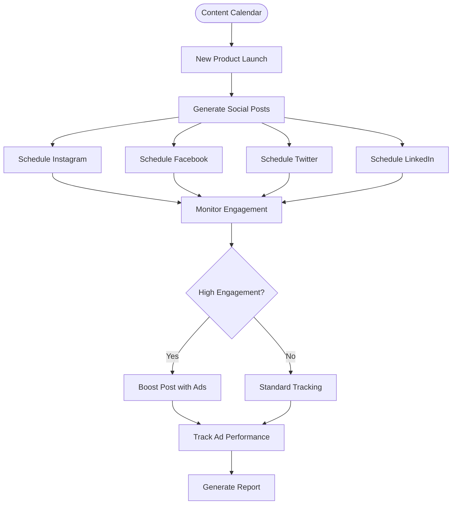

# Plan de Marketing Automatizado - TechSmart

## Resumen Ejecutivo

Estrategia de marketing digital completamente automatizada para TechSmart, utilizando n8n como motor de automatización para ejecutar campañas multicanal, segmentación inteligente y nurturing de clientes. El sistema integra email marketing, redes sociales, retargeting y analytics en un flujo unificado.

## Objetivos de Marketing

### Objetivos Primarios
1. **Adquisición**: 1,000 nuevos clientes en primeros 6 meses
2. **Conversión**: 3.5% conversion rate promedio
3. **Retención**: 60% customer retention rate
4. **AOV**: $150 average order value
5. **ROI**: 400% return on ad spend

### KPIs Clave
- **CTR**: >2.5% en campañas email
- **Engagement**: >5% en redes sociales
- **LTV**: $450 customer lifetime value
- **CAC**: <$35 customer acquisition cost

## Estrategia de Marketing Automatizado

### Segmentación de Audiencias

#### Segmento 1: Tech Enthusiasts (40%)
- **Perfil**: Early adopters, presupuesto alto
- **Productos**: Últimas innovaciones, gadgets premium
- **Canales**: Email premium, YouTube, LinkedIn

#### Segmento 2: Budget Conscious (35%)
- **Perfil**: Buscan value for money, comparadores
- **Productos**: Ofertas, productos con descuento
- **Canales**: Facebook, Instagram, newsletters de ofertas

#### Segmento 3: Business Users (25%)
- **Perfil**: Compras para empresa, bulk orders
- **Productos**: Hardware profesional, software empresarial
- **Canales**: LinkedIn, email B2B, content marketing

## Workflow de Marketing Automatizado

### Flujo Principal de Automatización



### Customer Journey Automatizado



## Workflows Específicos de n8n

### 1. Lead Nurturing Workflow



### 2. Abandoned Cart Recovery



### 3. Social Media Automation



## Campañas Específicas

### Campaña 1: Welcome Series
**Objetivo**: Onboarding de nuevos suscriptores
**Duración**: 14 días
**Emails**: 5 emails automatizados

1. **Día 0**: Bienvenida + Código descuento 10%
2. **Día 2**: Productos más populares
3. **Día 5**: Guía de compra tecnológica
4. **Día 10**: Testimonios de clientes
5. **Día 14**: Oferta especial exclusiva

### Campaña 2: Product Launch
**Objetivo**: Maximizar ventas de nuevos productos
**Duración**: 30 días
**Canales**: Email + Social + Ads

**Semana 1**: Teaser y early access
**Semana 2**: Launch oficial con contenido educativo
**Semana 3**: Social proof y reviews
**Semana 4**: Last chance offers

### Campaña 3: Seasonal Promotions
**Objetivo**: Aprovechar temporadas altas
**Eventos**: Black Friday, CES, Back to School

**Pre-evento**: Build-up y anticipation
**Durante evento**: Ofertas flash y urgency
**Post-evento**: Last chance y clearance

## Implementación Técnica

### Integraciones Clave

#### Email Marketing (Klaviyo/Mailchimp)
```javascript
// n8n Integration Example
{
  "webhook": "shopify_customer_created",
  "action": "add_to_segment",
  "segment": "new_customers",
  "trigger_sequence": "welcome_series"
}
```

#### Social Media (Hootsuite/Buffer)
```javascript
// Auto-posting Configuration
{
  "trigger": "new_trending_product",
  "platforms": ["instagram", "facebook", "twitter"],
  "content_template": "product_announcement",
  "schedule": "optimal_times"
}
```

#### Analytics (Google Analytics 4)
```javascript
// Event Tracking
{
  "event": "email_campaign_click",
  "parameters": {
    "campaign_id": "welcome_series_email_2",
    "customer_segment": "tech_enthusiast",
    "product_category": "smartphones"
  }
}
```

### Workflows de n8n - Configuración

#### Workflow: Email Campaign Automation
```json
{
  "name": "TechSmart_EmailCampaigns",
  "nodes": [
    {
      "name": "Shopify_Webhook",
      "type": "n8n-nodes-base.webhook",
      "parameters": {
        "path": "customer-created",
        "httpMethod": "POST"
      }
    },
    {
      "name": "Customer_Segmentation",
      "type": "n8n-nodes-base.code",
      "parameters": {
        "jsCode": "// Segment customer based on behavior and demographics"
      }
    },
    {
      "name": "Klaviyo_AddContact",
      "type": "n8n-nodes-base.klaviyo",
      "parameters": {
        "operation": "add",
        "listId": "{{$node.Customer_Segmentation.json.segment_id}}"
      }
    }
  ]
}
```

## Dashboard y Métricas

### Dashboard Principal
1. **Revenue Attribution**: Revenue por canal
2. **Campaign Performance**: CTR, conversion rates
3. **Customer Journey**: Progression através de funnels
4. **Segment Analysis**: Performance por segmento
5. **Retention Metrics**: Churn rate, LTV

### Reportes Automatizados
- **Weekly**: Performance summary
- **Monthly**: ROI analysis y optimización
- **Quarterly**: Strategy review y ajustes

## Presupuesto de Marketing

### Herramientas (Mensual)
- **Klaviyo Pro**: $60/mes
- **Hootsuite**: $49/mes
- **n8n Cloud**: $50/mes
- **Facebook/Google Ads**: $1,500/mes
- **Analytics Tools**: $100/mes
- **Total Herramientas**: $1,759/mes

### Ad Spend Distribution
- **Google Ads**: 40% ($600/mes)
- **Facebook/Instagram**: 35% ($525/mes)
- **LinkedIn Ads**: 15% ($225/mes)
- **Influencer Marketing**: 10% ($150/mes)

### ROI Proyectado
- **Inversión Total**: $1,759/mes
- **Revenue Esperado**: $7,000/mes
- **ROI**: 300%+

## Cronograma de Implementación

### Mes 1: Setup Base
- [ ] Configuración de herramientas
- [ ] Workflows básicos de n8n
- [ ] Welcome series
- [ ] Tracking setup

### Mes 2: Campañas Avanzadas
- [ ] Abandoned cart recovery
- [ ] Segmentación automática
- [ ] Social media automation
- [ ] Retargeting campaigns

### Mes 3: Optimización
- [ ] A/B testing sistemático
- [ ] Advanced personalization
- [ ] Predictive analytics
- [ ] Performance optimization

### Mes 4-6: Scaling
- [ ] Advanced workflows
- [ ] Machine learning integration
- [ ] Multi-channel attribution
- [ ] Customer lifetime optimization

---

*Plan diseñado para generar $42K revenue en primeros 6 meses*