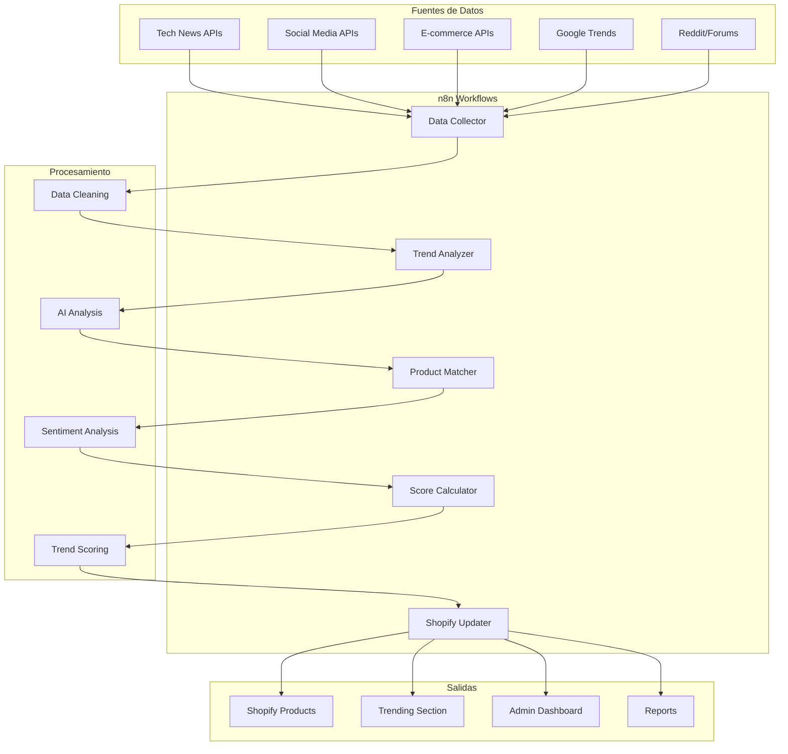
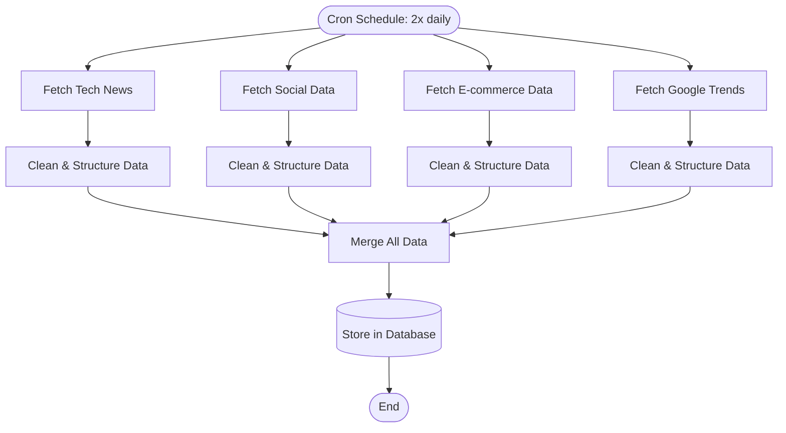
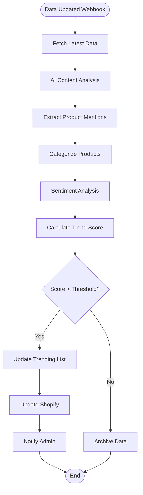
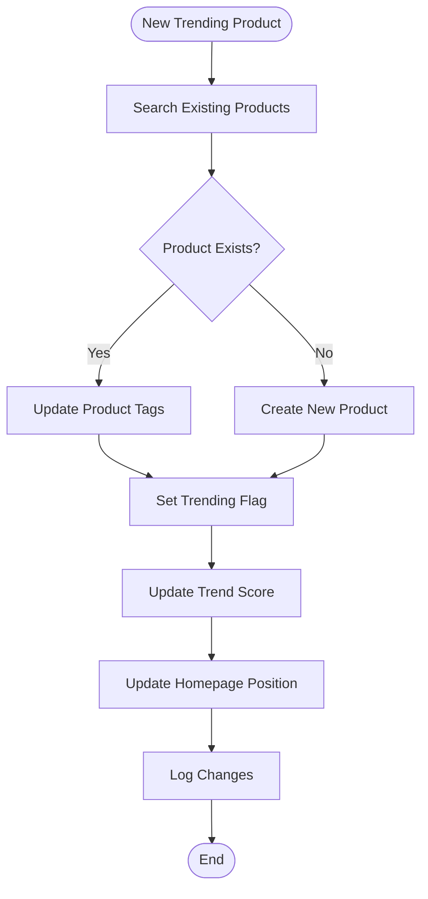

# Sistema de Tendencias Automatizado - TechSmart

## Resumen Ejecutivo

Sistema automatizado para identificar, analizar y mostrar productos tecnológicos en tendencia utilizando n8n como motor de automatización. El sistema recopila datos de múltiples fuentes, los procesa con IA y actualiza automáticamente el catálogo de TechSmart.

## Objetivos del Sistema

1. **Identificación automática** de productos tech trending
2. **Actualización dinámica** del catálogo de productos
3. **Scoring inteligente** basado en múltiples métricas
4. **Integración seamless** con Shopify
5. **Dashboard de monitoreo** en tiempo real

## Arquitectura del Sistema

### Componentes Principales



## Workflow Detallado de n8n

### 1. Data Collection Workflow



### 2. Trend Analysis Workflow



### 3. Product Matching & Update Workflow



## Fuentes de Datos

### Fuentes Primarias
1. **Tech News APIs**
   - TechCrunch API
   - The Verge RSS
   - Wired Tech Feed
   - Ars Technica API

2. **Social Media APIs**
   - Twitter API v2 (tech hashtags)
   - Reddit API (r/technology, r/gadgets)
   - Facebook Pages API (tech pages)
   - Instagram Influencers API

3. **E-commerce Data**
   - Amazon Best Sellers API
   - Best Buy API
   - Newegg API
   - AliExpress Trending

4. **Trend Analytics**
   - Google Trends API
   - Facebook Commerce Insights
   - SEMrush Trending Keywords

### Fuentes Secundarias
- GitHub trending repos
- Product Hunt launches
- Kickstarter tech projects
- Patent filings (USPTO API)

## Sistema de Scoring

### Métricas de Tendencia
```javascript
trendScore = (
  socialMentions * 0.3 +
  newsArticles * 0.25 +
  searchVolume * 0.2 +
  salesRank * 0.15 +
  sentimentScore * 0.1
) * recencyMultiplier
```

### Categorías de Score
- **🔥 Hot (90-100)**: Trending explosivo
- **📈 Rising (70-89)**: Tendencia creciente
- **👀 Watch (50-69)**: Potencial interés
- **📊 Monitor (30-49)**: Seguimiento básico
- **❄️ Cold (0-29)**: Sin tendencia

## Implementación Técnica

### n8n Workflows Configuration

#### Workflow 1: Data Collection
```json
{
  "name": "TechSmart_DataCollection",
  "nodes": [
    {
      "name": "Schedule",
      "type": "n8n-nodes-base.cron",
      "parameters": {
        "rule": {
          "interval": [{"field": "hours", "value": 12}]
        }
      }
    },
    {
      "name": "TechNews_Fetch",
      "type": "n8n-nodes-base.httpRequest",
      "parameters": {
        "url": "https://api.techcrunch.com/latest",
        "responseFormat": "json"
      }
    },
    {
      "name": "Data_Processing",
      "type": "n8n-nodes-base.code",
      "parameters": {
        "jsCode": "// Process and clean data\nreturn items.map(item => ({\n  title: item.title,\n  content: item.content,\n  timestamp: new Date(),\n  source: 'techcrunch'\n}));"
      }
    }
  ]
}
```

#### Workflow 2: AI Analysis
```json
{
  "name": "TechSmart_AIAnalysis",
  "nodes": [
    {
      "name": "OpenAI_Analysis",
      "type": "n8n-nodes-base.openAi",
      "parameters": {
        "operation": "text",
        "model": "gpt-4",
        "prompt": "Analyze this tech content and extract trending product mentions with sentiment scores..."
      }
    },
    {
      "name": "Score_Calculator",
      "type": "n8n-nodes-base.code",
      "parameters": {
        "jsCode": "// Calculate trend scores based on multiple factors"
      }
    }
  ]
}
```

### Integración con Shopify

#### GraphQL Mutations
```graphql
mutation updateProductTags($id: ID!, $tags: [String!]!) {
  productUpdate(input: {
    id: $id,
    tags: $tags
  }) {
    product {
      id
      tags
    }
  }
}

mutation createProduct($input: ProductInput!) {
  productCreate(input: $input) {
    product {
      id
      title
      handle
    }
  }
}
```

## Dashboard y Monitoreo

### Métricas Clave
1. **Productos identificados/día**
2. **Score promedio de tendencias**
3. **Conversión trending → ventas**
4. **Tiempo respuesta del sistema**
5. **Precisión de predicciones**

### Alertas Automáticas
- Producto viral detectado (score > 95)
- Fallo en fuente de datos
- Score system anomalies
- Performance degradation

## Cronograma de Implementación

### Fase 1: Setup Básico (Semana 1-2)
- [ ] Configuración n8n Cloud
- [ ] Setup APIs básicas (Google Trends, Reddit)
- [ ] Workflow de recolección simple
- [ ] Integración Shopify básica

### Fase 2: Análisis Avanzado (Semana 3-4)
- [ ] Integración OpenAI para análisis
- [ ] Sistema de scoring completo
- [ ] Múltiples fuentes de datos
- [ ] Dashboard básico

### Fase 3: Optimización (Semana 5-6)
- [ ] Machine learning para mejores predicciones
- [ ] Dashboard avanzado
- [ ] Sistema de alertas
- [ ] Testing y ajustes

### Fase 4: Lanzamiento (Semana 7-8)
- [ ] Monitoreo en producción
- [ ] Documentación completa
- [ ] Training para el equipo
- [ ] Optimizaciones finales

## Costos Estimados

### Servicios Mensuales
- **n8n Cloud Pro**: $50/mes
- **OpenAI API**: $30-100/mes
- **External APIs**: $20-50/mes
- **Hosting adicional**: $10-20/mes
- **Total**: $110-220/mes

### ROI Esperado
- **Aumento en conversiones**: +15-25%
- **Tiempo ahorrado**: 20 horas/semana
- **Ventaja competitiva**: Productos trending 2-7 días antes que competencia

---

*Sistema diseñado para escalar con el crecimiento de TechSmart*